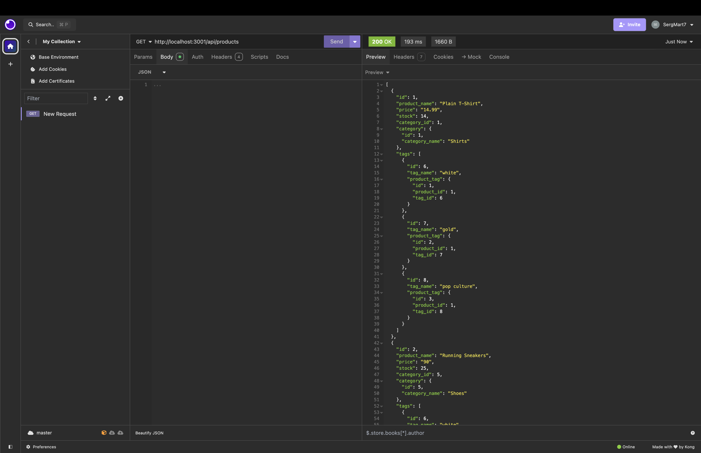

# ORMBE

## Description

ORMBE is a back end server for a online retail store to view and magage existing products, tus making a back end to our project

## Table of Contents

- [Installation](#installation)
- [Usage](#usage)
- [License](#license)
- [Contributing](#contributing)
- [Questions](#questions)

## Installation

Log in in github and do a git clone to have our files on your locoal machine

## Usage

Manage and organize products from a store

## License

This project is licensed under the MIT License. For more information, please visit [this link](https://opensource.org/licenses/MIT).

## Contributing

Any idea will be recieved with open arms and will try to make it a reality

## Questions

If you have any questions about the repo, open an issue or contact me directly at sergiomartinezdesantiago7@gmail.com. You can find more of my work at [SergMart7](https://github.com/SergMart7).

## Link to Repository

http://github.com/SergMart7/ORMBE

## Screenshots

